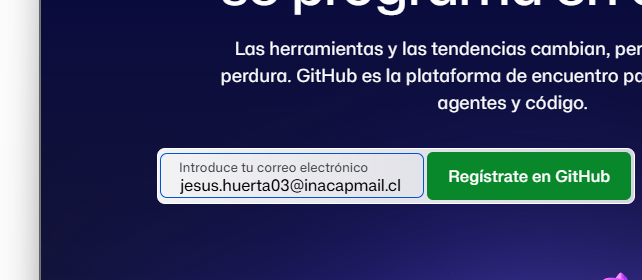
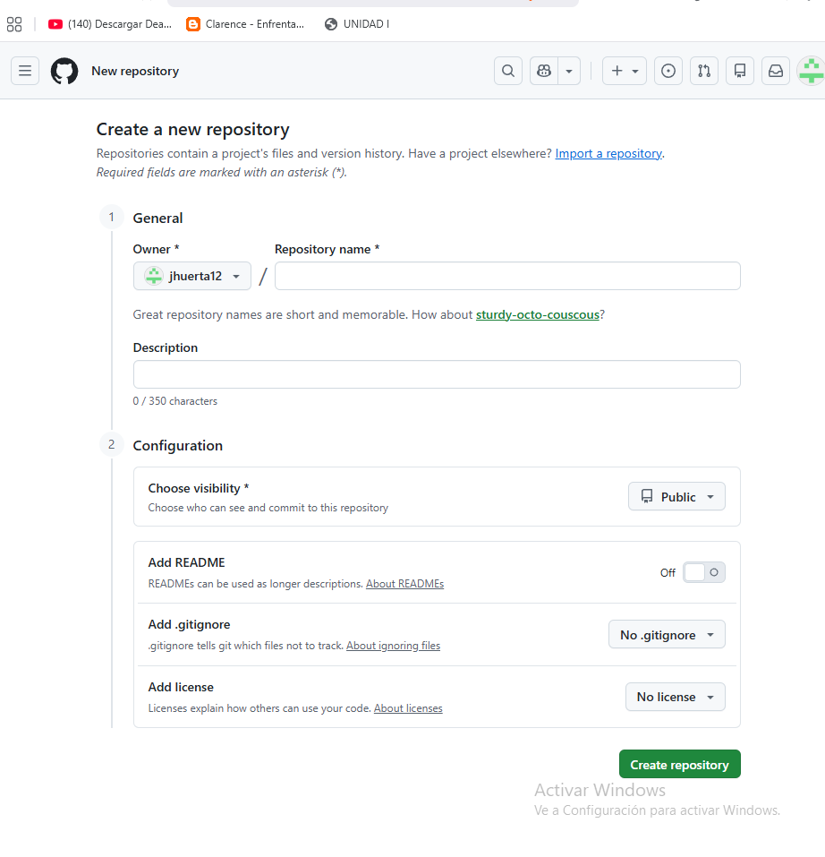
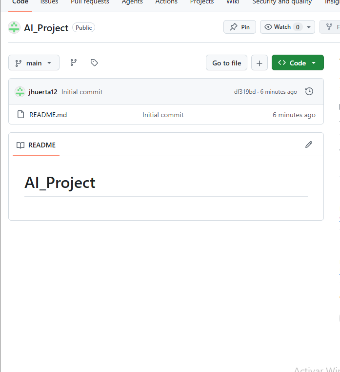
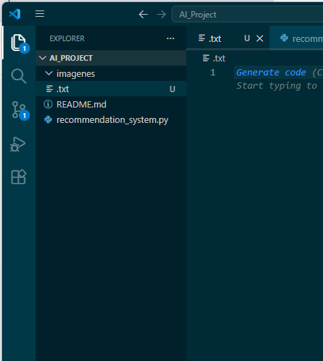
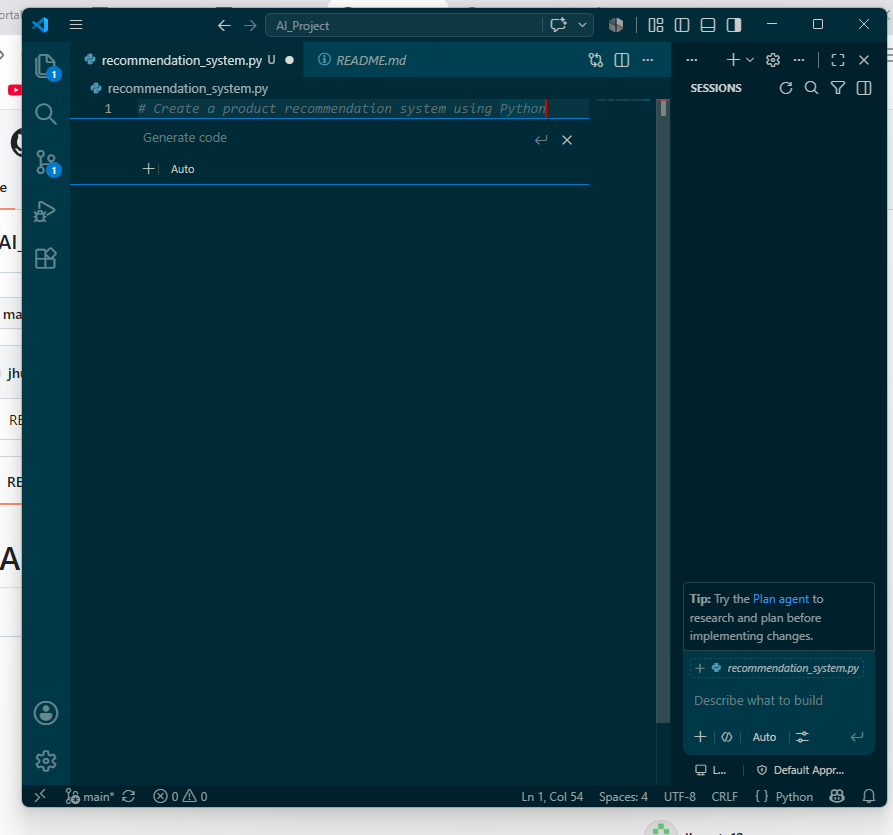
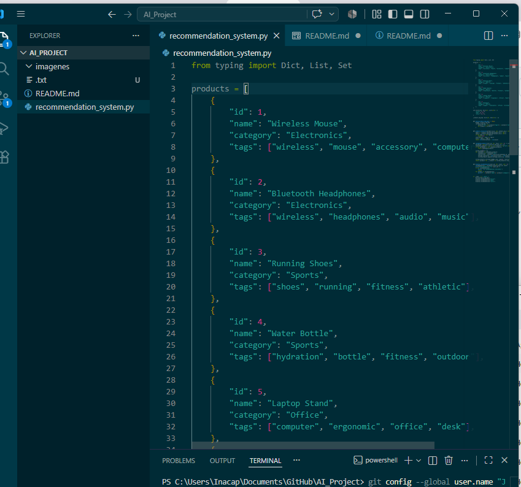
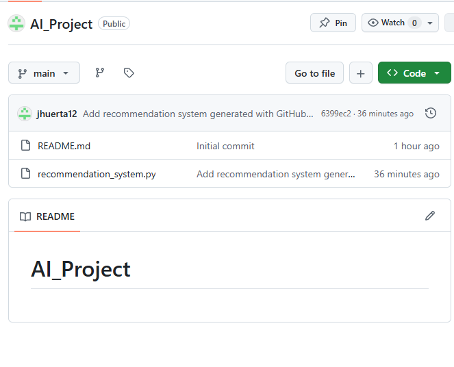

# AI_Project

## Actividad Formativa - GitHub Copilot

**Nombre:** Jesús Huerta

**Asignatura:** Inteligencia Artificial

**Institución:** INACAP

---

# Objetivo

Utilizar GitHub Copilot para generar código en Python y administrar un proyecto mediante GitHub y Visual Studio Code.

---

# Desarrollo de la actividad

## 1. Creación de la cuenta de GitHub

Se creó una cuenta de GitHub utilizando el correo institucional y posteriormente se inició sesión correctamente.

---

## 2. Creación del repositorio

Se creó un repositorio público llamado **AI_Project**, el cual almacenará el código fuente y la documentación de la actividad.

---

## 3. Repositorio creado

Una vez creado el repositorio, se verificó que contara con el archivo **README.md** y quedara listo para comenzar el desarrollo.

---

## 4. Clonación del repositorio en Visual Studio Code

Se clonó el repositorio desde GitHub utilizando Visual Studio Code para trabajar localmente con Git.

---

## 5. Uso de GitHub Copilot

Se creó el archivo **recommendation_system.py** y posteriormente GitHub Copilot generó automáticamente un sistema básico de recomendación en Python.

---

## 6. Código generado

GitHub Copilot generó el código inicial del sistema de recomendación, el cual fue aceptado y guardado en el proyecto.

---

## 7. Repositorio final

Finalmente se realizó el **Commit** y el **Push** hacia GitHub, verificando que el archivo `recommendation_system.py` quedara almacenado correctamente dentro del repositorio.

---

# Archivos del proyecto

- README.md
- recommendation_system.py

---

# Tecnologías utilizadas

- Python
- Git
- GitHub
- GitHub Copilot
- Visual Studio Code

---

# Conclusión

Durante esta actividad se utilizó GitHub Copilot para generar automáticamente código en Python, facilitando el desarrollo de un sistema básico de recomendación. Además, se aplicó el uso de Git y GitHub para gestionar versiones del proyecto, realizar commits y sincronizar los cambios con un repositorio remoto. La experiencia permitió conocer el flujo básico de trabajo utilizando herramientas modernas de desarrollo asistidas por inteligencia artificial.